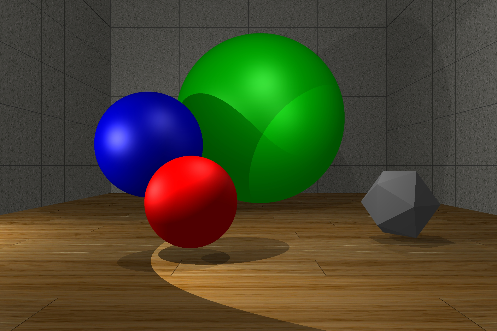
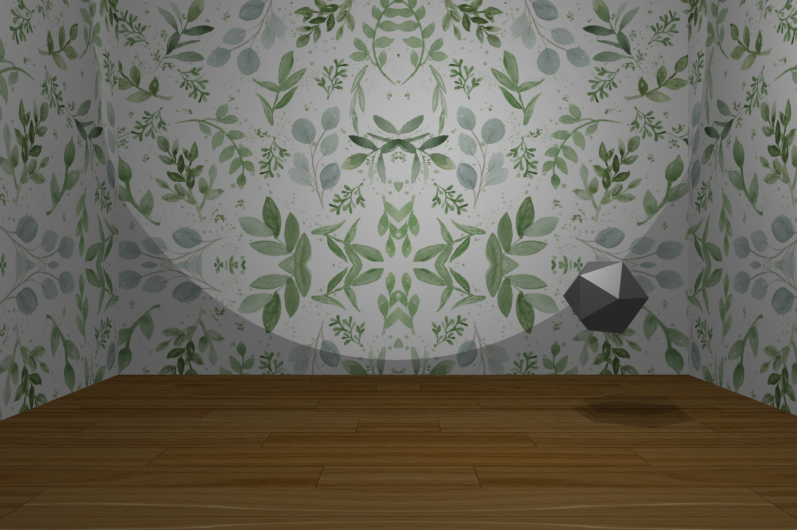
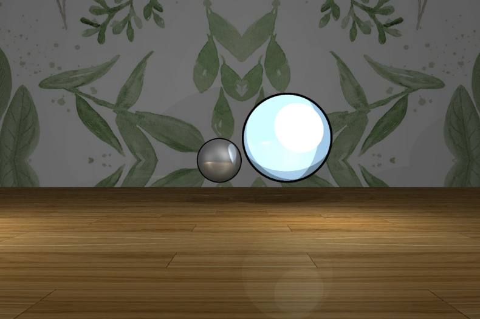
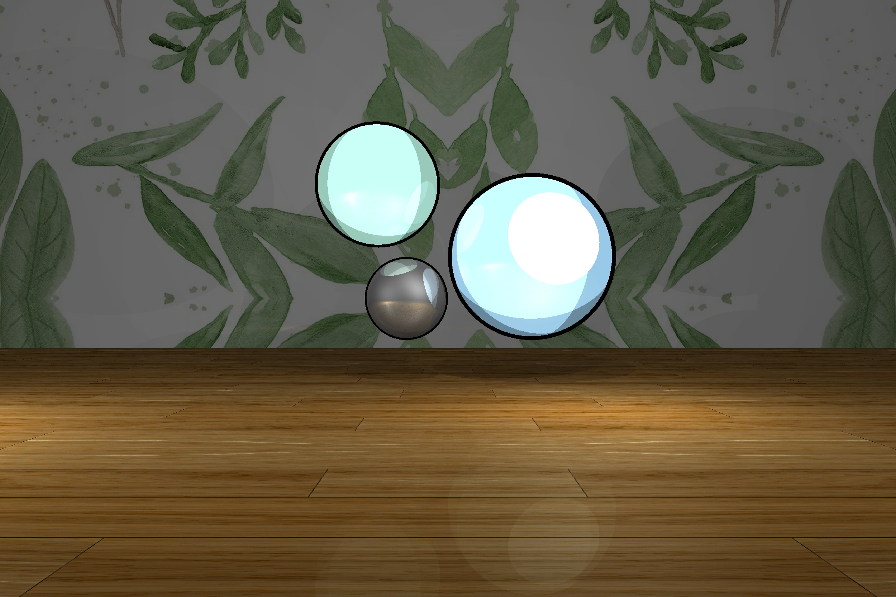

# Raytracer
This is a project I completed for my CS116A class with Kevin Smith. Professor Smith provided our class with a lot of helpful starter code and was a great help in learning about computer rendering, so I want to thank him for that.  

My raytracer is written in C++ using the OpenFrameworks toolkit. Right now, it can render a scene with basic primitive shapes with the essential diffuse & specular lighting. It supports loading in textures onto planes as background imagery. As a fun little feature, I tried implementing a cel-shaded feature, but it's pretty basic.

## Example Renders
Basic render

Texture Mapping

Cel-Shading Examples

